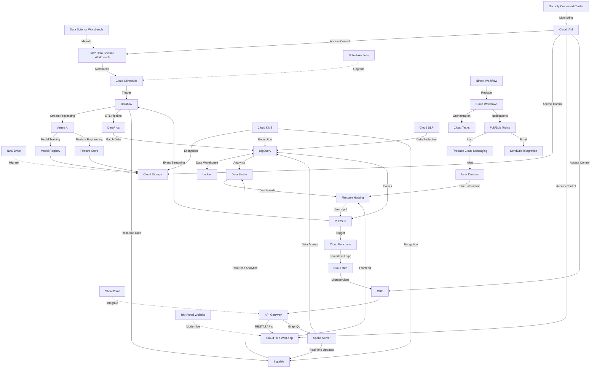

# GCP Evolution Infrastructure Diagram

## Enterprise-Level Evolution Roadmap

## Key GCP Components for Enterprise Evolution

### Data Processing & AI
- **Data Science Workbench (DSW)**: Fully managed JupyterLab environment
- **Vertex AI**: End-to-end ML platform for model building and deployment
- **Feature Store**: Centralized repository for ML features
- **Dataflow**: Stream and batch processing service
- **DataProc**: Managed Hadoop and Spark service

### Data Storage & Analytics
- **Cloud Storage**: Object storage for unstructured data
- **BigQuery**: Serverless, scalable data warehouse
- **Bigtable**: NoSQL database for real-time applications
- **Looker**: Business intelligence platform
- **Data Studio**: Interactive data visualization

### Event System & Messaging
- **Pub/Sub**: Real-time messaging service
- **Cloud Functions**: Serverless event-driven computing
- **Cloud Run**: Fully managed containerized applications
- **GKE**: Managed Kubernetes service

### Web & API Layer
- **API Gateway**: Managed API platform
- **Cloud Run Web App**: Containerized web applications
- **Apollo Server**: GraphQL implementation
- **Firebase Hosting**: Fast and secure hosting

### Workflow & Notifications
- **Cloud Workflows**: Workflow orchestration service
- **Cloud Tasks**: Asynchronous task execution
- **Firebase Cloud Messaging**: Cross-platform messaging
- **SendGrid Integration**: Email delivery service

### Security & Governance
- **Cloud IAM**: Identity and Access Management
- **Cloud KMS**: Key Management Service
- **Cloud DLP**: Data Loss Prevention
- **Security Command Center**: Security management system

## Evolution Benefits

1. **Real-Time Data Processing**:
   - Transition from batch to real-time data streams
   - Enable immediate insights and actions

2. **Scalable Infrastructure**:
   - Auto-scaling resources based on demand
   - Handle enterprise-level workloads

3. **Advanced AI Capabilities**:
   - Sophisticated ML models with Vertex AI
   - Continuous training and monitoring

4. **Enhanced Security**:
   - Enterprise-grade security controls
   - Comprehensive data protection

5. **Cost Optimization**:
   - Pay-as-you-go pricing
   - Serverless architecture minimizes costs

6. **Developer Productivity**:
   - Managed services reduce operational overhead
   - Streamlined CI/CD pipelines

## Implementation Phases

1. **Phase 1: Foundation**
   - Migrate data to Cloud Storage and BigQuery
   - Set up basic GCP infrastructure and IAM

2. **Phase 2: Data Pipeline Modernization**
   - Implement Dataflow for ETL processes
   - Set up Pub/Sub for event-driven architecture

3. **Phase 3: AI & ML Integration**
   - Deploy Vertex AI models
   - Implement Feature Store for ML features

4. **Phase 4: Application Modernization**
   - Migrate web applications to Cloud Run
   - Implement API Gateway and GraphQL

5. **Phase 5: Advanced Analytics**
   - Deploy Looker for business intelligence
   - Implement real-time dashboards with Data Studio
