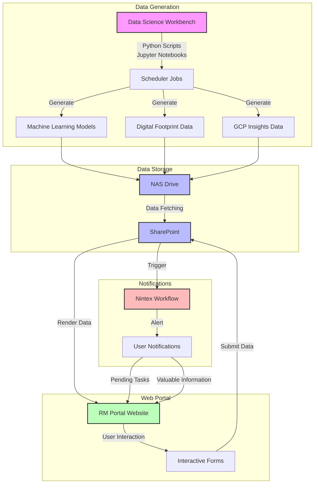

# RM Portal Infrastructure Diagram

## Project Infrastructure Flow

## Alternative Visualization (Draw.io format)

For a more detailed presentation to sponsors, you may want to consider using Draw.io to create a more visually appealing diagram. The structure would be similar to the Mermaid diagram above, but with more customization options for colors, icons, and layout.

## Infrastructure Components Description

1. **Data Generation Layer**
   - Data Science Workbench with Jupyter Notebooks
   - Scheduled Python scripts for automated data processing
   - Outputs: ML models, digital footprint data, and GCP insights

2. **Data Storage Layer**
   - NAS Drive as primary storage for generated data
   - SharePoint for web-accessible storage and form data

3. **Web Portal Layer**
   - RM Portal Website for data visualization and user interaction
   - Interactive forms for data collection from users

4. **Notification System**
   - Nintex Workflow integration with SharePoint
   - Automated alerts for pending tasks and valuable information
   - User notification delivery system

## Benefits of This Architecture

- **Automated Data Pipeline**: From data generation to visualization
- **Centralized Storage**: All data accessible through SharePoint
- **Interactive User Experience**: Forms and notifications enhance user engagement
- **Workflow Automation**: Nintex provides automated task management
